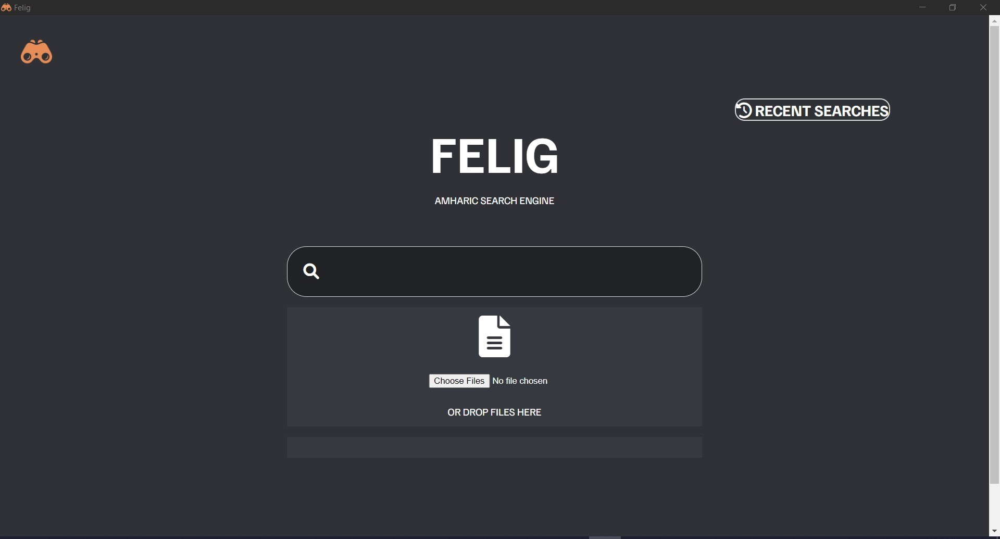

  

<h1 align="center">Felig</h1>

  <strong>Amharic Search Engine Desktop App built using <a href = "https://github.com/liulalemx/felig-toolkit"> felig-toolkit </a>. 💻</strong>

---

## Installation

Get the official builds from [here, in GitHub Releases](https://github.com/liulalemx/felig/releases) for Windows.

**_Notes:_**

- If a warning message pops up on Windows, go to 'more info' and select 'Run Anyway'

## How to run locally

### Prerequisites

- [nodejs](https://nodejs.org/en/)

1. Clone the repository
1. Run `npm install`
1. Run `npm run start`
